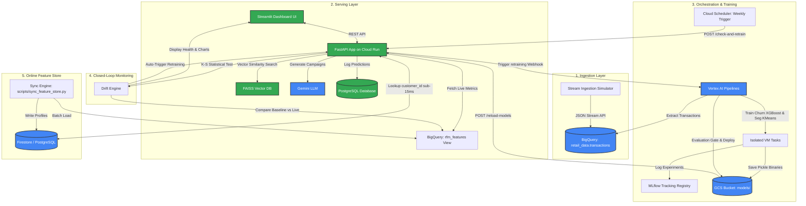

# E-commerce Analytics & Churn Prediction MLOps Platform
## System Architecture & Technical Specifications

This document outlines the architecture, data flows, and technical design decisions of the E-commerce Customer Segmentation & Churn Prediction MLOps Platform.

---

## 1. System Architecture Overview

The platform is designed around a **closed-loop feedback system** that connects real-time data ingestion, model inference, automated orchestration, and statistical monitoring.

---

## 2. Component Specifications

### 2.1. Ingestion Layer (Stream Simulator)
*   **Location**: [scripts/simulate_stream.py](file:///Users/Anna/ecommerce-data-pipeline/scripts/simulate_stream.py)
*   **Mechanism**: Emulates live user transaction streams by writing directly to the Google BigQuery table using the streaming insertion API.
*   **Modes**:
    *   `Standard`: Simulates standard buying behaviors (5% baseline order cancellations).
    *   `Drift Cancellations`: Simulates cancellation drift (40%+ cancellations).
    *   `Drift Velocity`: Simulates velocity drift (spiked order quantities and prices).
*   **Epoch-Alignment**: Simulated transaction timestamps are anchored in the **December 2011** epoch to prevent shifting the absolute max date in the database, preserving the static recency calculation without time distortion.

### 2.2. Serving Layer (FastAPI & Streamlit)
*   **FastAPI Backend**: Located in [app/main.py](file:///Users/Anna/ecommerce-data-pipeline/app/main.py). Runs as a containerized serverless application on Google Cloud Run. Handles prediction logging, vector catalog search, LLM-generated campaigns, model hot-reloads, and drift metrics calculation.
*   **Streamlit UI**: Located in [streamlit_app.py](file:///Users/Anna/ecommerce-data-pipeline/streamlit_app.py). Renders segmentation clusters, churn probabilities, vector similarities, LLM marketing campaign copy, and live distribution comparison histograms.
*   **Vector Search & Multi-Agent GenAI**: Performs similarity search on e-commerce catalog items using FAISS, feeding recommended products into a **4-Agent Collaborative Assembly Line** (Behavioral Analyst -> Campaign Strategist -> Creative Copywriter -> Quality & Compliance Critic) evaluated by Gemini to craft personalized, guardrailed email campaigns.

### 2.3. Orchestration & Training (Vertex AI Pipelines)
*   **Location**: [pipelines/churn_kfp_pipeline.py](file:///Users/Anna/ecommerce-data-pipeline/pipelines/churn_kfp_pipeline.py)
*   **DAG Structure**: 
    1.  `extract_data_comp`: Queries clean raw data from BigQuery.
    2.  `train_churn_comp` / `train_segmentation_comp`: Executes parallel training tasks for XGBoost (Churn) and KMeans (Clustering).
    3.  `evaluate_deploy_comp`: Assesses the candidate churn model F1-Score against the active model. If candidate score is equal or superior, it uploads both pickle binaries to GCS and triggers a dynamic API reload.
*   **Step-level Caching**: Caching is globally enabled to conserve resources, but disabled specifically for `extract_data_comp`. Downstream tasks automatically execute if fresh data is extracted, but reuse the cache if the database hasn't changed.

### 2.4. Statistical Monitoring (K-S Drift Engine)
*   **Location**: [src/monitoring.py](file:///Users/Anna/ecommerce-data-pipeline/src/monitoring.py)
*   **Method**: Uses the two-sample **Kolmogorov-Smirnov (K-S) test** from `scipy.stats` to compare the baseline training distribution (`rfm_customers.csv`) with the live target distribution (queried from the BigQuery `rfm_features` view).
*   **Drift Condition**: Rejects the null hypothesis (meaning drift is detected) if the calculated $p$-value for any feature (`recency`, `frequency`, `avg_order_value`) is $< 0.05$.
*   **Closed-Loop**: If drift is detected, the Streamlit app warns the operator and provides a button to trigger the retraining webhook.

### 2.5. Online Feature Store & Scheduler
*   **Synchronization Script**: [scripts/sync_feature_store.py](file:///Users/Anna/ecommerce-data-pipeline/scripts/sync_feature_store.py) runs to pre-compute and sync customer features.
*   **Serving Mode Lookup**:
    *   **Cloud Mode (`USE_BIGQUERY=true`)**: Queries **Google Cloud Firestore** (sub-15ms document key-value lookup) with BigQuery fallback.
    *   **Local Mode (`USE_BIGQUERY=false`)**: Queries the local **PostgreSQL** `online_customer_features` table.
*   **Cron Automation**: A **Google Cloud Scheduler** HTTP job triggers the `/monitoring/check-and-retrain` webhook weekly (`0 0 * * 0`) using OIDC Compute Engine service account token authentication.

---

## 3. Key Design Decisions & Rationales

### 3.1. Serverless serving vs. Vertex AI Endpoints
*   **Decision**: Bypassed Vertex AI Endpoints in favor of GCS storage and Cloud Run serverless hosting.
*   **Rationale**: Vertex Endpoints require dedicated, always-on Virtual Machines, costing ~$70–$100/month per model even when idle. Cloud Run scale-to-zero capability allows running the service for practically $0/month when idle, loading models into RAM dynamically.

### 3.2. In-Memory Dynamic Hot-Reloading
*   **Decision**: Implemented an in-RAM reload mechanism in the FastAPI application triggered by a webhook POST request.
*   **Rationale**: Prevents server downtime during deployment. When a new model is pushed to GCS by the pipeline, Cloud Run swaps the models in memory dynamically without restarting the container, ensuring 100% availability.

### 3.3. Gateway-Safe Traceback Handling
*   **Decision**: Configured simulator endpoints to catch exceptions and return a `200 OK` JSON payload containing error and traceback information, instead of throwing an unhandled `500 Server Error`.
*   **Rationale**: GCP Load Balancers intercept raw HTTP 500 responses and replace them with generic HTML error pages. Returning `200 OK` with error metadata ensures full diagnostic tracebacks are displayed directly in the Streamlit frontend.

### 3.4. Memory-Optimized Lazy Imports
*   **Decision**: Deferred importing `google.cloud.aiplatform` and its modules to the inside of the execution endpoints instead of at the top of the file.
*   **Rationale**: The Vertex AI SDK is highly memory-intensive. Lazy importing keeps the container startup memory footprint below 350 MiB, preventing Cloud Run from terminating instances for exceeding the 512 MiB limit.

### 3.5. Hybrid Online Feature Store (PostgreSQL & Firestore)
*   **Decision**: Implemented a dual-backend Key-Value lookup serving layer (PostgreSQL locally, Firestore in the cloud) rather than legacy Vertex AI Feature Stores.
*   **Rationale**: Managed cloud feature stores require high-cost resources (always-on Bigtable clusters running at $100+/month). Firestore provides a serverless document key-value store with sub-15ms queries and a free tier of 50k reads/writes per day. PostgreSQL local mapping allows offline, zero-dependency developer integration without GCP credentials.

