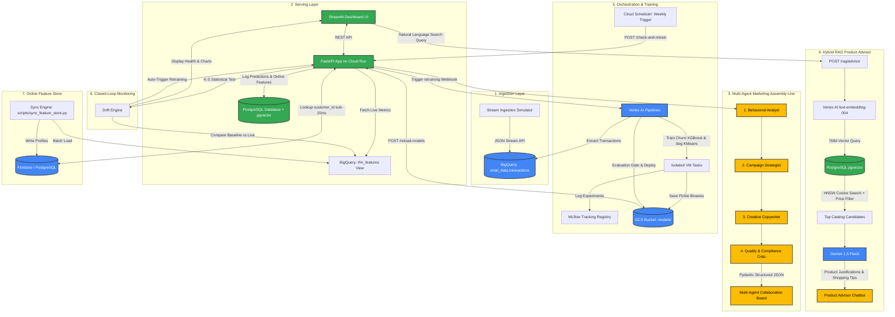

# E-commerce Analytics & Churn Prediction MLOps Platform
## System Architecture & Technical Specifications

This document outlines the architecture, data flows, and technical design decisions of the E-commerce Customer Segmentation, Churn Prediction, Multi-Agent GenAI, and pgvector RAG Platform.

---

## 1. System Architecture Overview

The platform is designed around a **closed-loop feedback system** that connects real-time data ingestion, model inference, automated orchestration, statistical drift monitoring, multi-agent AI marketing generation, and pgvector-powered semantic search.

---

## 2. Component Specifications

### 2.1. Ingestion Layer (Stream Simulator)
*   **Location**: [scripts/simulate_stream.py](file:///Users/Anna/ecommerce-data-pipeline/scripts/simulate_stream.py)
*   **Mechanism**: Emulates live user transaction streams by writing directly to the Google BigQuery table using the streaming insertion API.
*   **Modes**:
    *   `Standard`: Simulates standard buying behaviors (5% baseline order cancellations).
    *   `Drift Cancellations`: Simulates cancellation drift (40%+ cancellations).
    *   `Drift Velocity`: Simulates velocity drift (spiked order quantities and prices).
*   **Epoch-Alignment**: Simulated transaction timestamps are anchored in the **December 2011** epoch to prevent shifting the absolute max date in the database, preserving static recency calculations without time distortion.

### 2.2. Serving Layer (FastAPI & Streamlit)
*   **FastAPI Backend**: Located in [app/main.py](file:///Users/Anna/ecommerce-data-pipeline/app/main.py). Runs as a containerized serverless application on Google Cloud Run. Handles prediction logging, vector catalog search, LLM-generated campaigns, model hot-reloads, and drift metrics calculation.
*   **Streamlit UI**: Located in [streamlit_app.py](file:///Users/Anna/ecommerce-data-pipeline/streamlit_app.py). Renders segmentation clusters, churn probabilities, multi-agent marketing traces, live drift histograms, and the conversational Product Advisor chatbot.

### 2.3. Multi-Agent Collaborative Marketing Assembly Line (Phase 13)
*   **Location**: [app/agent_service.py](file:///Users/Anna/ecommerce-data-pipeline/app/agent_service.py)
*   **Assembly Line Architecture**: Replaces monolithic prompts with a **4-Agent Collaborative Workflow**:
    1.  **Behavioral Analyst (`_run_analyst_agent`)**: Objective behavioral diagnostics (velocity analysis, cancellation risk, segment assessment).
    2.  **Campaign Strategist (`_run_strategist_agent`)**: Commercial angle formulation, promotional code selection (`WINBACK20`, `SHIPSAFE`, `LOYALTYVIP`), and product pairing.
    3.  **Creative Copywriter (`_run_copywriter_agent`)**: Subject line generation and persuasive, personalized email body copywriting.
    4.  **Quality & Compliance Critic (`_run_critic_agent`)**: Compliance audit (ensures internal ML cluster names never leak to customers), tone polish, and dispatch scheduling.
*   **Structured Outputs**: Utilizes **Pydantic Schemas** (`StrategyPlan`, `CopywriterDraft`, `CriticReview`) with Gemini's `response_mime_type="application/json"` and `response_schema` parameters, eliminating fragile manual string parsing (`.split()`, `.replace()`).
*   **UI Collaboration Board**: Displays interactive expanders in Tab 3 of Streamlit showing the step-by-step intermediate thoughts of each agent.

### 2.4. Hybrid RAG Product Advisor with `pgvector` (Phase 14)
*   **Location**: [app/rag_service.py](file:///Users/Anna/ecommerce-data-pipeline/app/rag_service.py), [scripts/sync_product_vectors.py](file:///Users/Anna/ecommerce-data-pipeline/scripts/sync_product_vectors.py), and [app/db_postgres.py](file:///Users/Anna/ecommerce-data-pipeline/app/db_postgres.py).
*   **Contextual Multi-Attribute Embeddings**: Enriches raw products with category classifications and style/seasonal tags (*Title + Category + Price + Seasonal Tags*) before generating **768-dimensional embeddings** via Vertex AI `text-embedding-004`.
*   **pgvector & HNSW Indexing**: Stored natively in PostgreSQL `product_catalog_vectors` with an **HNSW cosine index** (`USING hnsw (embedding vector_cosine_ops)`) for sub-millisecond retrieval.
*   **Hybrid Search & Budget Filtering**: Executes parameterized SQL queries that simultaneously enforce budget constraints (`unit_price <= max_budget`) and rank by cosine distance (`<=>`).
*   **Conversational Chatbot with RAG Guardrails**: In Tab 5 of Streamlit, a conversational assistant explains *why* each candidate item was selected and gracefully handles out-of-domain requests (e.g. sports equipment or electronics) by clarifying store specialties.

### 2.5. Autonomous Agent with LangGraph & Cyclic Feedback Loops (Phase 15)
*   **Location**: [app/agent_graph.py](file:///Users/Anna/ecommerce-data-pipeline/app/agent_graph.py)
*   **Stateful Graph Machine (`StateGraph`)**: Replaces rigid procedural execution with a stateful computational graph using `langgraph`.
*   **Encapsulated Nodes & Typed State**: `MarketingGraphState` manages shared memory across 5 nodes (`analyst`, `strategist`, `copywriter`, `critic`, `format_output`).
*   **Cyclic Feedback & Self-Correction**: Implements conditional edge routing (`_should_revise_or_end`). When the Critic rejects a draft due to tone or non-compliance, it routes the state back to the Copywriter node with specific critique feedback instructions (up to a 3-iteration safety limit).
*   **API & UI Integration**: Exposes `GET /predict/campaign-graph/{customer_id}` and renders a live iteration-by-iteration DAG timeline in Streamlit.

### 2.6. Orchestration & Training (Vertex AI Pipelines)
*   **Location**: [pipelines/churn_kfp_pipeline.py](file:///Users/Anna/ecommerce-data-pipeline/pipelines/churn_kfp_pipeline.py)
*   **DAG Structure**: 
    1.  `extract_data_comp`: Queries clean raw data from BigQuery.
    2.  `train_churn_comp` / `train_segmentation_comp`: Executes parallel training tasks for XGBoost (Churn) and KMeans (Clustering).
    3.  `evaluate_deploy_comp`: Assesses candidate churn model F1-Score against active model. If candidate score is equal or superior, it uploads both pickle binaries to GCS and triggers dynamic API reload.
*   **Step-level Caching**: Caching is globally enabled to conserve resources, but disabled specifically for `extract_data_comp`. Downstream tasks automatically execute if fresh data is extracted, but reuse the cache if the database hasn't changed.

### 2.7. Statistical Monitoring (K-S Drift Engine)
*   **Location**: [src/monitoring.py](file:///Users/Anna/ecommerce-data-pipeline/src/monitoring.py)
*   **Method**: Uses the two-sample **Kolmogorov-Smirnov (K-S) test** from `scipy.stats` to compare the baseline training distribution (`rfm_customers.csv`) with the live target distribution (queried from BigQuery `rfm_features` view).
*   **Drift Condition**: Rejects the null hypothesis (drift detected) if the calculated $p$-value for any feature (`recency`, `frequency`, `avg_order_value`) is $< 0.05$.
*   **Closed-Loop**: If drift is detected, Streamlit warns the operator and provides a one-click retraining trigger.

### 2.8. Online Feature Store & Cloud Scheduler
*   **Synchronization Script**: [scripts/sync_feature_store.py](file:///Users/Anna/ecommerce-data-pipeline/scripts/sync_feature_store.py) pre-computes and syncs customer features.
*   **Serving Mode Lookup**:
    *   **Cloud Mode (`USE_BIGQUERY=true`)**: Queries **Google Cloud Firestore** (sub-15ms document key-value lookup) with BigQuery view fallback.
    *   **Local Mode (`USE_BIGQUERY=false`)**: Queries local **PostgreSQL** `online_customer_features` table.
*   **Cron Automation**: A **Google Cloud Scheduler** HTTP job triggers the `/monitoring/check-and-retrain` webhook weekly (`0 0 * * 0`) using OIDC Compute Engine service account token authentication.

### 2.9. Infrastructure as Code (Terraform Layer) (Phase 16)
*   **Location**: [terraform/](file:///Users/Anna/ecommerce-data-pipeline/terraform)
*   **Declarative Provisioning**: Full HCL-based provisioning of all Google Cloud Platform components:
    *   `main.tf`: Enables required Google APIs automatically.
    *   `storage.tf`: Creates GCS model bucket with lifecycle versioning.
    *   `bigquery.tf`: Creates `retail_data` dataset, time-partitioned tables, and `rfm_features` view.
    *   `firestore.tf`: Enables Cloud Firestore native NoSQL mode.
    *   `cloud_run.tf`: Deploys serverless backend and dashboard with memory sizing (`1Gi`) and public IAM invoker policies.
    *   `scheduler.tf`: Configures the weekly model evaluation cron job.
    *   `pubsub.tf`: Defines streaming topics and fan-out subscriptions.
    *   `dataflow.tf`: Configures the BigQuery streaming customer aggregates table.
*   **Environment Agnostic**: Parameterized via `variables.tf` and `terraform.tfvars.example` for multi-environment deployments (`dev`, `staging`, `production`).

### 2.10. Streaming ETL & Feature Engineering (Apache Beam & Dataflow) (Phase 18)
*   **Location**: [src/dataflow_pipeline.py](file:///Users/Anna/ecommerce-data-pipeline/src/dataflow_pipeline.py)
*   **Unified Batch & Streaming Engine**: Implemented an **Apache Beam** pipeline that consumes real-time transactions from Google Cloud Pub/Sub, executes **5-minute fixed windowing (`window.FixedWindows(300)`)**, calculates customer rolling metrics (total spend, unique orders, cancellations), and derives real-time **spending velocity** and cancellation ratios before streaming to BigQuery `streaming_customer_aggregates`.
*   **DirectRunner & DataflowRunner**: Supports both local deterministic unit testing via `DirectRunner` and horizontal autoscaling on Google Cloud Dataflow.

### 2.11. Master Enterprise Workflow Orchestration (Apache Airflow & Cloud Composer) (Phase 19)
*   **Location**: [dags/ecommerce_master_pipeline_dag.py](file:///Users/Anna/ecommerce-data-pipeline/dags/ecommerce_master_pipeline_dag.py)
*   **Master Orchestration Graph**: Orchestrates the daily data lifecycle:
    1.  `check_raw_transactions`: Verifies data availability in BigQuery.
    2.  `validate_data_quality`: Enforces schema and data quality rules (non-null IDs, strictly positive prices).
    3.  `refresh_rfm_features`: Recalculates analytical RFM features.
    4.  `sync_online_feature_store` & `sync_product_vectors`: Synchronizes the Online Feature Store (Firestore/PostgreSQL) and pgvector semantic embeddings concurrently.
    5.  `evaluate_statistical_drift_branch`: Runs a 2-sample Kolmogorov-Smirnov test; branches to `trigger_vertex_ml_pipeline` if drift $p < 0.05$.

### 2.12. Unified Secure Ingress (Google Cloud API Gateway & OpenAPI) (Phase 20)
*   **Location**: [api_gateway/openapi.yaml](file:///Users/Anna/ecommerce-data-pipeline/api_gateway/openapi.yaml) & [terraform/api_gateway.tf](file:///Users/Anna/ecommerce-data-pipeline/terraform/api_gateway.tf)
*   **Edge Ingress Layer**: Deploys a Google Cloud API Gateway instance configured via a declarative OpenAPI 2.0/3.0 contract.
*   **Features**:
    *   API Key authentication (`x-api-key`) enforced at Google's global network edge.
    *   `x-google-backend` dispatching to Cloud Run serverless microservices.
    *   Rate limiting, DDoS protection, and multi-tenant URL mapping (`/v1/predict/churn`, `/v1/predict/campaign-graph/{customer_id}`, `/v1/rag/advisor`).

---

## 3. Key Design Decisions & Rationales

### 3.1. Serverless Serving vs. Dedicated Vertex AI Endpoints
*   **Decision**: Bypassed Vertex AI Endpoints in favor of GCS storage and Cloud Run serverless hosting.
*   **Rationale**: Vertex Endpoints require dedicated, always-on Virtual Machines costing ~$70–$100/month per model even when idle. Cloud Run scale-to-zero capability allows running the service for $0.00/month when idle, loading models into RAM dynamically.

### 3.2. In-Memory Dynamic Hot-Reloading
*   **Decision**: Implemented an in-RAM reload mechanism in FastAPI triggered by a webhook POST request.
*   **Rationale**: Prevents server downtime during deployment. When a new model is pushed to GCS by the pipeline, Cloud Run swaps the models in memory dynamically without restarting the container, ensuring 100% availability.

### 3.3. Pydantic Structured Outputs vs. Regex/String Slicing (Phase 13)
*   **Decision**: Enforced JSON schemas using Pydantic models and `GenerationConfig(response_mime_type="application/json", response_schema=...)` across all agents.
*   **Rationale**: LLMs naturally engage in polite conversational chit-chat (`"Sure! Here is your plan:"`) or wrap text in markdown backticks, which breaks standard `json.loads()` and crashes APIs. Setting `response_mime_type="application/json"` applies token-level constrained decoding, guaranteeing valid JSON every time.

### 3.4. PostgreSQL `pgvector` vs. Standalone Vector Databases (Phase 14)
*   **Decision**: Integrated vector similarity search directly inside our existing PostgreSQL database using the `pgvector` extension and HNSW indexing, rather than introducing third-party vector databases (Pinecone, Qdrant, Milvus).
*   **Rationale**: Co-locating relational feature tables, prediction logs, and vector embeddings in a single PostgreSQL instance reduces operational overhead, eliminates multi-database synchronization lag, and allows hybrid SQL filtering (e.g. `WHERE unit_price <= 25.0 ORDER BY embedding <=> query_vector`).

### 3.5. Hybrid Online Feature Store (PostgreSQL & Firestore)
*   **Decision**: Implemented a dual-backend Key-Value lookup serving layer (PostgreSQL locally, Firestore in the cloud) rather than legacy Vertex AI Feature Stores.
*   **Rationale**: Managed cloud feature stores require high-cost resources (always-on Bigtable clusters running at $100+/month). Firestore provides a serverless document key-value store with sub-15ms queries and a generous permanent free tier of 50k reads/writes per day.

### 3.6. Stateful Graph Orchestration vs. Static Pipelines (Phase 15)
*   **Decision**: Implemented `langgraph` StateGraph for agent collaboration with cyclic revision loops rather than static sequential function calls.
*   **Rationale**: Real-world generative marketing copy requires automated quality assurance. If a compliance critic rejects a draft (e.g., tone is too aggressive or a discount code is missing for an at-risk customer), LangGraph enables autonomous self-correction by dynamically re-routing back to the copywriter node with actionable feedback before returning to the user.

### 3.7. Infrastructure as Code (IaC) vs. ClickOps (Phase 16)
*   **Decision**: Provisioned all cloud infrastructure using Terraform rather than manual configuration in the GCP Console.
*   **Rationale**: Guarantees environment parity between development and production, prevents configuration drift, enables disaster recovery in under 2 minutes, and provides a clear Git-audited trail of all architectural changes.

### 3.8. Event-Driven Pub/Sub Streaming vs. Direct Synchronous Writes (Phase 17)
*   **Decision**: Implemented an asynchronous message broker layer via Google Cloud Pub/Sub (`retail-transactions-topic`) with fan-out subscriptions to BigQuery and the Online Feature Store, rather than direct synchronous database insertions.
*   **Rationale**: Eliminates checkout blocking latency, provides a shock-absorbing buffer against traffic spikes during high-volume periods (e.g. Black Friday), prevents data loss if downstream databases experience transient latency, and allows independent scaling of consumers (Warehouse ingestion vs. Real-time Feature Store updates).

### 3.9. Serverless Apache Beam on Dataflow vs. Spark on Dataproc (Phase 18)
*   **Decision**: Selected Apache Beam on Google Cloud Dataflow for streaming ETL and windowed feature calculation instead of hosting Apache Spark on Dataproc.
*   **Rationale**: Dataflow provides true serverless autoscaling with zero cluster management, scales worker VMs dynamically based on pipeline backlog/watermark lag, and offers unified windowing semantics (fixed, sliding, session) across batch and streaming.

### 3.10. Dual-Level Dead Letter Queues (Defense in Depth)
*   **Decision**: Implemented Dead Letter Queues (DLQs) at two distinct layers: (1) **Pub/Sub Infrastructure DLQ** (`retail-transactions-dead-letter-topic` with `max_delivery_attempts = 5`), and (2) **Apache Beam Application DLQ** using `beam.pvalue.TaggedOutput("dead_letter", ...)`.
*   **Rationale**: Protects the streaming pipeline from "poison pill" messages. Pub/Sub DLQ intercepts infrastructure and network delivery crashes, preventing endless retry loops; Apache Beam DLQ intercepts data quality violations (malformed JSON, negative prices, missing customer IDs) without dropping records or stalling the streaming execution graph.

### 3.11. Cloud Composer (Airflow) as Platform Conductor vs. Vertex AI (Kubeflow) as ML Engine (Phase 19)
*   **Decision**: Established Apache Airflow on Cloud Composer as the top-level platform orchestrator for daily ETL, data quality audits, and feature store syncing, while delegating model training and evaluation gates to Vertex AI Pipelines (Kubeflow).
*   **Rationale**: Separates data pipeline orchestration (multi-system integrations, data contracts, and daily schedules) from containerized ML training workloads (GPU/TPU resource allocation, experiment tracking, and model registry governance). Airflow serves as the master conductor that only triggers Vertex AI when statistical feature drift is formally detected.

### 3.12. API Gateway Edge Security & Contract Enforcement vs. Direct Service Exposure (Phase 20)
*   **Decision**: Deployed Google Cloud API Gateway as the single reverse proxy ingress point backed by an explicit OpenAPI 2.0/3.0 specification, rather than exposing Cloud Run backend service URLs directly to public clients.
*   **Rationale**: Provides edge-level API key authorization and rate limiting before traffic reaches backend containers (protecting against DDoS and FinOps token exhaustion), decouples internal microservice routing from public clients, and enables multi-tenant client onboarding through standardized contracts.

