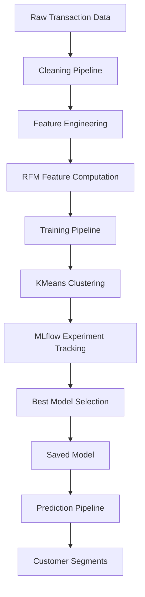

## Ecommerce Customer Segmentation Pipeline

This project implements an end-to-end machine learning pipeline for customer segmentation

This system performs:

- data ingestion
- data cleaning
- feature engineering
- RFM customer feature commputation
- clustering with KMeans
- experiment tracking with MLflow
- prediction pipeline for new data

The goal is to simulate a **production-style ML system**, not just a notebook experiment.

## Pipeline Architecure



## Project Structure

```
ecommerce-data-pipeline
│
├── config/                # configuration files
│   ├── experiment.yaml
│   ├── experiments/
│   └── paths.py
│
├── data/                  # datasets (not tracked in git)
│   ├── raw/
│   ├── processed/
│   └── predictions/
│
├── notebooks/             # exploratory analysis
│
├── src/                   # pipeline source code
│   ├── cleaning.py
│   ├── transformation.py
│   ├── rfm_features.py
│   ├── clustering.py
│   ├── ingestion.py
│   └── utils/
│       ├── config_loader.py
│       ├── config_schema.py
│       └── data_validation.py
│
├── main.py                # training pipeline entry point
├── predict.py             # prediction pipeline
├── app.py                 # Streamlit dashboard
└── requirements.txt
```

## Running the Pipeline

After installing dependencies, you can run different parts of the pipeline from the command line.

Install dependencies:

```bash
pip install -r requirements.txt
```

Run the full training pipeline:

```bash
python main.py all
```

Run clustering only:

```bash
python main.py cluster
```

Run prediction pipeline:

```bash
python predict.py
```

or

```bash
python predict.py --input data/raw/online_retail.csv
```

## Experiment Tracking

Experiments are tracked using MLfow.

To view experiments:

```bash
mlflow ui
```

Then open:

http://localhost:5000

## Technologies

- Python
- Pandas
- Scikit-learn
- MLflow
- YAML configuration
- Git

## Future Improvements

Planned improvements include:

- Docker containerization
- experiment configuration system
- improved model evaluation
- deployment of prediction API


